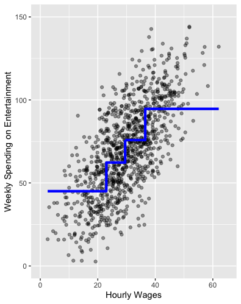

```{css,echo = F}
.small .remark-code { /*Change made here*/
  font-size: 85% !important;
}
.tiny .remark-code { /*Change made here*/
  font-size: 50% !important;
}
```

```{r,include=F}
set.seed(123)
options(width=60)
knitr::opts_chunk$set(fig.align='center',fig.width=9,fig.height=5,message=F,warning=F)
def.chunk.hook  <- knitr::knit_hooks$get("chunk")
knitr::knit_hooks$set(chunk = function(x, options) {
  x <- def.chunk.hook(x, options)
  ifelse(options$size != "normalsize", paste0("\n \\", options$size,"\n\n", x, "\n\n \\normalsize"), x)
})
```

# Learning Goals

1. Skew, logs, and coefficients

2. Evaluating a regression: Univariate and multivariate visualization of errors

3. Next time: Root Mean Squared Error (RMSE) and cross Validation

---

# Regression Recap

--

- Regression very similar to **conditional means**

<center></center>

---

# Regression Recap

- Regression very similar to **conditional means**
  
<center></center>


---

# Regression Recap

- For this class, don't need to know how it happens

--

  - But the intuition is obvious
  
--

  - Given $Y = \alpha + \beta X$, just tweak $\alpha$ and $\beta$ to reduce **errors**
  
--

  - Once you've minimized all the errors, you have the **line of best fit**
  
---

# Visual Intuition

<center></center>

---

# Evaluating Regression Results

- Understanding the **errors** helps us evaluate the model

--

- Define the errors $\varepsilon = Y - \hat{Y}$

--

  - True outcome values $Y$
  
  - Predicted outcome values $\hat{Y}$
  
--

- Useful to assess model performance

--

1. **Look** with univariate and multivariate visualization of the errors

2. Calculate the **RMSE**

---

# Introducing the .red[Data]

--

- New dataset on **movies**

--

  - Download `mv.Rds` to your `data` folder and load to object `mv`
  
  - `require` `tidyverse`, and `plotly` packages

```{r,message=F,warning=F}
require(tidyverse)

mv <- read_rds('../data/mv.Rds')
```


---

# RQ: Hollywood Finances

- .blue[Research Question]: What is the relationship between a movie's budget (how much it costs to make a movie) and a movie's earnings (how much money people pay to see the movie in theaters)?

--

- .blue[Theory]: More money spent means more famous actors, better special effects, stronger marketing

--

- .blue[Hypothesis]: earnings (`gross`) and costs (`budget`) should be **positively** correlated

--

  - $X$: ?
  
  - $Y$: ? 
  
---

### Follow the process: Look

--

- TONS of missingness!

```{r}
summary(mv %>% select(gross,budget))
```

---

# Missingness

- What does this mean for "generalizability"

--

  - "Generalizability": Do our conclusions from this data extend ("generalize") to the population at large?
  
```{r}
p <- mv %>%
  mutate(missing = ifelse(is.na(gross) | is.na(budget),1,0)) %>%
  group_by(year) %>%
  summarise(propMissing = mean(missing)) %>% # Calculate the proportion of observations missing either gross or budget
  ggplot(aes(x = year,y = propMissing)) + 
  geom_bar(stat = 'identity') + 
  labs(x = 'Year',y = '% Missing') + 
  scale_y_continuous(labels = scales::percent) # Format the y-axis labels
```

---

# Missingness

- We can only speak to post-2000s Hollywood!

```{r}
p
```

---

# Follow the process: Look

- What **type** of variables are earnings (`gross`) and costs (`budget`)?
  
```{r}
mv %>% 
  drop_na(gross,budget) %>%
  select(gross,budget) %>% glimpse()
```

--

- Looks like continuous measures to me!

---

# 2. Univariate Visualization

```{r,warning=F}
mv %>%
  select(title,gross,budget) %>%
  gather(metric,dollars,-title) %>%
  ggplot(aes(x = dollars,color = metric)) + 
  geom_density()
```


---

# Log and Skew

--

- Univariate visualization highlights significant **skew** in both measures

--

  - Most movies don't cost a lot and don't make a lot, but there are a few blockbusters that pull the density way out
  
--

- Let's **wrangle** two new variables that take the log of these skewed measures

--

  - Logging transforms skewed measures to more "normal" measures
  
  - This is helpful for regression!

```{r}
mv <- mv %>%
  mutate(gross_log = log(gross),
         budget_log = log(budget))
```

---

# 2. Univariate Visualization

```{r,warning=F}
mv %>%
  select(title,gross_log,budget_log) %>%
  gather(metric,log_dollars,-title) %>%
  ggplot(aes(x = log_dollars,color = metric)) + 
  geom_density()
```


---

# 3. Conditional Analysis

--

- Continuous X continuous variables? Scatter with `geom_point()`!

```{r,warning=F}
mv %>%
  ggplot(aes(x = budget_log,y = gross_log)) + 
  geom_point()
```

---

# 3. Conditional Analysis

- (BTW, I know I've been violating the tenets of data viz for several slides now. Let's fix that.)

```{r}
pSimple <- mv %>%
  drop_na(budget,gross) %>%
  mutate(profitable = ifelse(gross > budget,'Profitable','Unprofitable')) %>%
  ggplot(aes(x = budget,y = gross,text = paste0(title,' (',genre,', ',year,')'))) + 
  geom_point() + 
  scale_x_log10(labels = scales::dollar) + 
  scale_y_log10(labels = scales::dollar) + 
  labs(title = "Movie Costs and Returns",
       x = "Costs (logged budget)",
       y = "Returns (logged gross)")

pFancy <- pSimple + geom_point(aes(color = profitable)) + 
  scale_color_manual(guide = 'none',values = rev(c('red','black'))) + 
  geom_abline(intercept = 0,slope = 1)
```

---

# 3. Conditional Analysis

```{r,warning=F}
pFancy
```

---

# Look with `plotly` to see outliers

```{r,warning=F,message=F}
require(plotly)
ggplotly(pFancy,tooltip = 'text')
```


---

# 4. Regression!

```{r,message = F,warning=F}
pSimple + 
  geom_smooth(aes(group = 1),method = 'lm',se = F)
```

---

# 4. Regression!

```{r}
m <- lm(gross_log ~ budget_log,data = mv)
summary(m)
```

---

# Interpretation

- Remember the equation: $Y = \alpha + \beta * X$

- Our $Y$ is logged gross

- Our $X$ is logged budget

- Thus we can rewrite as $gross\_log = \alpha + \beta * budget\_log$

- What is $\alpha$? What is $\beta$?

--

$gross\_log = 1.26 + 0.96 * budget\_log$

---

# Interpreting with Logs

- Previously, we said:

  - $\alpha$ is the value of $Y$ when $X$ is zero
  
  - We need to convert back out of logged values using the `exp()` function
  
  - When `budget_log` is zero, the budget is `exp(0)` or $1

- Thus, we say when the budget is \$1, the movie makes 1.26 logged dollars, or $3.53

```{r}
exp(1.26107)
```

---

# Interpreting with Logs

- For the $\beta$ coefficient, it depends on where the logged variable appears:

--

  1. `log(Y) ~ X`: 1 unit change in $X$ &rarr; `(exp(b)-1)*100`% change in $Y$
  
  2. `Y ~ log(X)`: 1% increase in $X$ &rarr; `b/100` unit change in $Y$
  
  3. `log(Y) ~ log(X)`: 1% increase in $X$ &rarr; `b`% change in $Y$
  
--

- In our example, a 1% increase in the budget corresponds to a 0.96% increase in gross

- You will either need to memorize these rules, or (like me) just look them up every time

