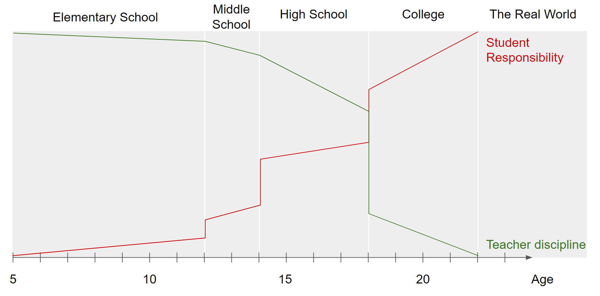

```{css,echo = F}
.small .remark-code { /*Change made here*/
  font-size: 85% !important;
}
.tiny .remark-code { /*Change made here*/
  font-size: 50% !important;
}
```

```{r,include=F}
set.seed(123)
options(width=60)
knitr::opts_chunk$set(fig.align='center',fig.width=9,fig.height=5,message=F,warning=F)
def.chunk.hook  <- knitr::knit_hooks$get("chunk")
knitr::knit_hooks$set(chunk = function(x, options) {
  x <- def.chunk.hook(x, options)
  ifelse(options$size != "normalsize", paste0("\n \\", options$size,"\n\n", x, "\n\n \\normalsize"), x)
})
```

# Agenda

1. Course Motivation

  - What is data science & why should we care?

2. Course Objectives

  - **Content:** Critical thinking, analysis

  - **Skills:** Computing and analysis in R

3. ChatGPT and data science
  
4. Course Expectations & Syllabus review

---

# Why are you here?

--

background-image: url(./figs/fight_ds_econ.PNG)
background-size: 80%

--

background-image: url(./figs/fight_ds_ps.PNG)
background-size: 80%

--

background-image: url(./figs/fight_ds_cs.PNG)
background-size: 80%

--

background-image: url(./figs/fight_ds_stats.PNG)
background-size: 80%

--

background-image: url(./figs/fight_ds_stem.PNG)
background-size: 80%

---

# Is this all just a fad?

--

- No


<center></center>


---

# Is this all just a fad?

- But there are faddish qualities

<center></center>


---

# So what IS data science?

- Split into two camps

--

1. .blue[Research] camp

--

  - Focused on **answering a research question**
  
  - Follows the "scientific method"
  
  - Goal: contribute to knowledge
  
  - Domain: academia
  
--
  
2. .red[Prediction] camp

--

  - Focused on **making a prediction**
  
  - Typically unconcerned with theory or *why* a model works
  
  - Goal: inform a decision / policy
  
  - Domain: private sector

  
---

# The Two Camps

<center></center>

---

# The Two Camps

<center></center>

---


# .blue[Research] Camp

- The scientific method

  1. .red[Observation] &rarr; .blue[Question]

--

  2. .blue[Theory] &rarr; .blue[Hypothesis]

--

  3. .red[Data Collection / Wrangling] &rarr; .red[Analysis]

--

  4. .red[Results] &rarr; .blue[Conclusion]
  
--

```{r,echo=F,fig.height=3,fig.align='center',warning=F,message=F}
require(tidyverse)
data.frame(step = c('Observation','Question','Theory','Hypothesis','Data Collection',
                    'Analysis','Results','Conclusion'),
           Framework = c('Data','Science','Science','Science','Data','Data','Data','Science'),
           x = c(.5,1.5,2.5,3.5,4.5,5.5,6.5,7.5),
           xend = c(1.5,2.5,3.5,4.5,5.5,6.5,7.5,8.5),
           y = c(-.5,-1,-2,-.75,-2,-1,-.75,-.5),
           yend = c(.5,1,2,.75,2,1,.75,.5)) %>%
  ggplot(aes(x = x,y = y,fill = Framework)) + 
  geom_rect(aes(xmin = x,ymin = y,xmax = xend,ymax = yend)) + 
  # geom_rect(xmin = c(2.5),ymin = c(-2),xmax = c(3.5),ymax = c(2),fill = NA,color = 'black',lwd = 2,
  #           inherit.aes = F) + 
  # geom_rect(xmin = c(4.5),ymin = c(-2),xmax = c(5.5),ymax = c(2),fill = NA,color = 'black',lwd = 2,
  #           inherit.aes = F) + 
  scale_fill_manual(values = c('red','blue')) +
  theme(axis.text.y = element_blank(),
        panel.background = element_rect(fill = 'grey90'),
        panel.grid.major = element_blank(), panel.grid.minor = element_blank(),
        axis.ticks = element_blank(),
        plot.background = element_rect(
          fill = "grey90" #,
          # colour = "black",
          # size = 1
        ),
        axis.text.x = element_text(angle = 45,hjust = 1,size = 14)) + 
  scale_x_continuous(breaks = seq(1,8,by = 1),labels = c('Observation','Question','Theory','Hypothesis','Data Prep',
                                                         'Analysis','Results','Conclusion')) + 
  xlab(NULL) + ylab(NULL)
```


---

# .blue[Research] Camp

- The scientific method

  1. .red[Observation] &rarr; .blue[Question]

  2. .blue[Theory] &rarr; .blue[Hypothesis]

  3. .red[Data Collection / Wrangling] &rarr; .red[Analysis]

  4. .red[Results] &rarr; .blue[Conclusion]

```{r,echo=F,fig.height=3,fig.align='center',warning=F,message=F}
require(tidyverse)
data.frame(step = c('Observation','Question','Theory','Hypothesis','Data Collection',
                    'Analysis','Results','Conclusion'),
           Framework = c('Data','Science','Science','Science','Data','Data','Data','Science'),
           x = c(.5,1.5,2.5,3.5,4.5,5.5,6.5,7.5),
           xend = c(1.5,2.5,3.5,4.5,5.5,6.5,7.5,8.5),
           y = c(-.5,-1,-2,-.75,-2,-1,-.75,-.5),
           yend = c(.5,1,2,.75,2,1,.75,.5)) %>%
  ggplot(aes(x = x,y = y,fill = Framework)) + 
  geom_rect(aes(xmin = x,ymin = y,xmax = xend,ymax = yend)) + 
  geom_rect(xmin = c(2.5),ymin = c(-2),xmax = c(3.5),ymax = c(2),fill = NA,color = 'black',lwd = 2,
            inherit.aes = F) + 
  geom_rect(xmin = c(4.5),ymin = c(-2),xmax = c(5.5),ymax = c(2),fill = NA,color = 'black',lwd = 2,
            inherit.aes = F) + 
  scale_fill_manual(values = c('red','blue')) +
  theme(axis.text.y = element_blank(),
        panel.background = element_rect(fill = 'grey90'),
        panel.grid.major = element_blank(), panel.grid.minor = element_blank(),
        axis.ticks = element_blank(),
        plot.background = element_rect(
          fill = "grey90" #,
          # colour = "black",
          # size = 1
        ),
        axis.text.x = element_text(angle = 45,hjust = 1,size = 14)) + 
  scale_x_continuous(breaks = seq(1,8,by = 1),labels = c('Observation','Question','Theory','Hypothesis','Data Prep',
                                                         'Analysis','Results','Conclusion')) + 
  xlab(NULL) + ylab(NULL)
```

---

# Course Objectives

- This course is the menu, not the food

--

  - Look over many different fields, methods, and tools

--

  - You pick those you like, and take more advanced classes to dig into them

--

- But we are very **hands on**

--

  - You must download `R` and `RStudio` prior to next lecture (Problem Set 0)
  
--

  - You must work through first HW using an `.Rmd` file
  
---

# Learning goals

1. Understand the uses of quantitative data for analyzing sophisticated research questions

--

2. Describe data used to investigate research questions, including univariate and multivariate visualizations and summary statistics.

--

3. Apply the appropriate methods to answer research questions and evaluate the hypotheses.


---

# ChatGPT in the classroom

- Are we at the precipice of a new era in human-computer relations?

--

  - ChatGPT can help you in achieving these learning goals
  
--

  - But it needs to be used wisely...it is still a tool
  
--

- It can make coding (the hardest part of this class) easier

--

- But it can also prevent you from learning

---

# AI in the labor market

- Is AI-assisted work is the future?

<!-- -- -->

<!--   - Profound gains in productivity already -->
  
--

<center></center>

---

# AI in the labor market


- Will this be like automation and globalization for US manufacturing?
  
--

  - What skills will be valuable in 5 years? 10 years?
  
--

- My answer: prepare you for both possibilities

--

  - If AI is a "fad", make sure you can do this work unassisted
  
  - If AI is the new normal, make sure you can work with it productively
  
--

- The one thing you **shouldn't** do

--

  - Take shortcuts / cheat
  
--

- You will still have an interview in which you are asked something like the following (actual interview question to a previous student): 

  - "In the next 30 minutes, recreate the following plot using R"

--

  - **You** need to know this answer


---

# Grades

- 14 homework assignments (2 points each). 

  - Only 12 are graded 
  - 2 are extra credit
  
--

- 4 problem sets (76 points total)
  
  - 2 extra credit points available each PSet
  
--

- 100 points: (12 x 2) + (19 x 4)

--

- +12 extra credit points available

---

# Grades: Homework

- Think of these as your readings/practice for each class. 

--

- One homework for almost every lecture

--

- Due by midnight on day assigned (no late homework accepted!)


---

# Grades: PSets

- 4 in total (Pset 0 doesn't count)
  
<!-- -- -->

<!-- - Tests your knowledge of the week's material -->

<!-- -- -->

<!-- - Work with your classmates! I want you all to get 100% on every PSet -->

--

- Posted to **GitHub** on Mondays at noon; due **Friday by midnight**

  - Submit/Upload to **Blackboard**

  - Each day late is -1 pt; after 3 days, scored zero
  
--

- Restrictions:

  - Open book / open note / open Campuswire

  - Can collaborate but submissions must be your own
  
--

- **Must submit a record of AI work with the problem set**

--
  
  - Print the output as PDF
  
---

# The Syllabus

- See: https://github.com/rweldzius/PSC4175_SUM2025 

---

# Honor Code

--

- Students are assumed to have read and agreed with the [Villanova University Academic Integrity policy](https://www.vanderbilt.edu/student_handbook/the-honor-system/)

--

- Violations of this policy may result in:

--

  - An F for the semester (at minimum)
  
  - Suspension for a semester
  
  - Expulsion
  
--

- However, except where **explicitly noted**, this course is collaborative

--

  - Open book, open note, open internet
  
  - Can rely on Campuswire for help
  
  - Can work together on problem sets (but must submit own work)
  

---

# Resources

- Campuswire (place for **questions**)

  - Post questions on the class feed
  
--

- Blackboard (place for **submissions**)

  - Submit homeworks and problem sets
  
--

- GitHub (place for **materials**)

  - Find all class materials
  
--

- Office hours (place for **hands-on help**)
  
---

# Teaching Philosophy

<center></center>

---

# Teaching Philosophy

- This course is **inherently** hard

--

  - Learning `R` is challenging
  
--

- But the goal is to **encourage** you to pursue data science

--

- As such, the **nature** of the material is at odds with the **goal** of the class

--

- My solution: grade leniently

--

  - i.e., lots of extra credit

---

# Conclusion

- Let's have a great summer semester!

--

- Homework:

--

  1. Review course Github page (https://github.com/rweldzius/PSC4175_SUM2025/tree/main)
  
  2. Work through psc4175_hw_1.Rmd (see Github)
  
  2. Create a CampusWire account (Link: https://campuswire.com/p/GF9F6AD11. PIN: 3731)
  
  3. Create a Copilot account (https://copilot.microsoft.com/)
