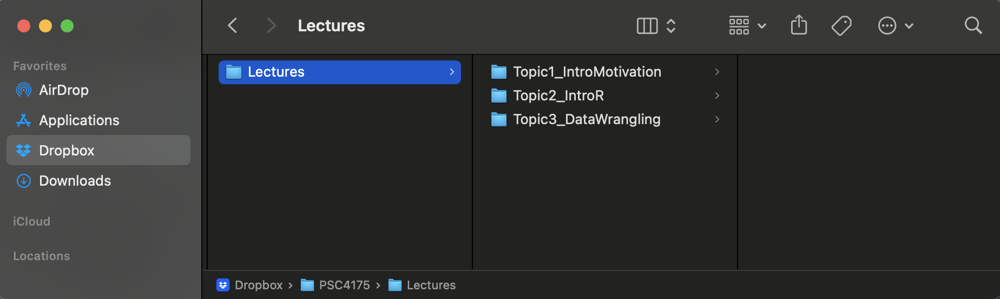
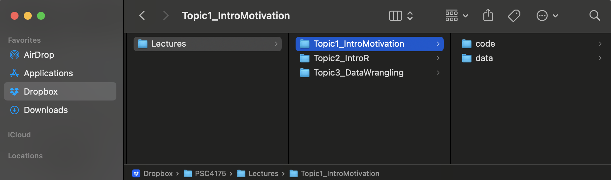

```{css,echo = F}
.small .remark-code { /*Change made here*/
  font-size: 85% !important;
}
.tiny .remark-code { /*Change made here*/
  font-size: 50% !important;
}
```

```{r,include=F}
set.seed(123)
options(width=60)
knitr::opts_chunk$set(fig.align='center',fig.width=9,fig.height=5,message=F,warning=F)
def.chunk.hook  <- knitr::knit_hooks$get("chunk")
knitr::knit_hooks$set(chunk = function(x, options) {
  x <- def.chunk.hook(x, options)
  ifelse(options$size != "normalsize", paste0("\n \\", options$size,"\n\n", x, "\n\n \\normalsize"), x)
})
```

<!-- # Agenda -->

<!-- 1. Getting set up -->

<!-- -- -->

<!--   - Folder structure + `setwd()` -->

<!-- -- -->

<!-- 2. Installing software -->

<!-- -- -->

<!--   - [`R: https://cran.r-project.org/`](https://cran.r-project.org/) -->

<!-- -- -->

<!--   - [`RStudio: https://rstudio.com/products/rstudio/download/`](https://rstudio.com/products/rstudio/download/) -->

<!-- -- -->

<!-- 3. Requiring packages -->

<!-- -- -->

<!--   - `install.packages("tidyverse")`  -->

<!-- -- -->

<!--   - `require(tidyverse)` -->

<!-- -- -->

<!-- 4. Loading and manipulating data -->

<!-- -- -->

<!--   - `readRDS()` -->

<!-- -- -->

<!--   - `%>%` -->

---

# Getting set up

--

- Folder structure + `setwd()`

--

  - Concept: keep everything together...
  
--

  - ...and **related**

--

.center[]


---

# Getting set up

- Folder structure + `setwd()`

  - Concept: keep everything together...

  - ...and **related**

.center[]


<!-- --- -->

<!-- # Installing software -->

<!-- -- -->

<!-- - [`R: https://cran.r-project.org/`](https://cran.r-project.org/) -->

<!--   - Accept all defaults -->

<!-- -- -->

<!-- - [`RStudio: https://rstudio.com/products/rstudio/download/`](https://rstudio.com/products/rstudio/download/) -->

<!--   - Download the version for your OS -->

<!-- -- -->

<!-- - Open `RStudio` and create a new rmarkdown (`.Rmd`) file -->

<!-- -- -->

<!--   - Accept defaults, give it a sensible name, delete the default text, then save it to your folder (again with a sensible name) -->

<!-- -- -->

<!--   - You should follow along with the lecture in this file! Take notes here! Try code here! -->

---

# How to type in `.Rmd`
````{verbatim, lang = "markdown"}
# This is a header

## This is a subheader

### This is a subsubheader

This is plain text.
````
--

# This is a header

## This is a subheader

### This is a subsubheader

This is plain text.


---

# How to type in `.Rmd`
````{verbatim, lang = "markdown"}
- This is

- a bulleted

  - List

1. This is

2. a numbered list
````

--

- This is

- a bulleted

  - List

1. This is

2. a numbered list

---

# How to type in `.Rmd`

```{verbatim, lang = "markdown"}
 **Bold font**, *italic font*, `code font`
```
--

**Bold font**, *italic font*, `code font`

--

- Most Importantly! `R` code!

````{verbatim,lang = "markdown"}
```{r}
2+2
```
````


--

```{r}
2+2
```

---

# How `R` Works

--

- **O**bject **O**riented **L**anguage (**OOL**)

--

  - Objects are created with the `<-` command
  
--

  - You *can* run code directly...
  

```{r}
2+2
```

---

# How `R` Works


- **O**bject **O**riented **L**anguage (**OOL**)

  - Objects are created with the `<-` command

  - ...but most of what we'll do involves objects
  

```{r}
object1 <- 2+2
```

--

- Object assignment operator **saves** the output

- It **does not print** the output

--

- To see, just call the object

```{r}
object1
```

---

# How `R` Works


- **O**bject **O**riented **L**anguage (**OOL**)

  - Objects are created with the `<-` command

  - They can be named anything (so be intuitive!)
  

```{r}
three_plus_three <- 2+2
three_plus_three
```

---

# How `R` Works

- **O**bject **O**riented **L**anguage (**OOL**)

  - Objects are created with the `<-` command

  - Objects can store many different things
  
```{r}
an_element <- 2+2
a_vector <- c(1,2,3)
a_list <- list('element1' = 2+2,
               'element2' = "Go Nova!",
               'element3' = runif(n = 10,min = 0,max = 10))
a_function <- function(x) {
  avg_of_x <- sum(x) / length(x)
  return(avg_of_x)
}
```

---

# How `R` Works

- Objects **persist!**
```{r}
an_element # This object stores 2+2
a_vector   # This object stores the integers 1, 2, and 3

an_element*a_vector
an_element-a_vector
```

---

# A comment on comments

- If you use a # sign inside a code chunk, you can write a comment

```{r}
# This is a comment. If I compile the code, nothing will happen.

# This is another comment. These are helpful for annotating my code.
```

---

# How `R` Works

- Objects **persist!**
```{r}
# This object stores:
  # 1) 2+2 (named "element1")
  # 2) the text "hello world!" (named "element2")
  # 3) 10 numbers randomly drawn between 0 and 10
a_list
```

---

# How `R` Works

- Objects **persist!**
```{r}
# Let's apply our function ("a_function") to "element3" in "a_list"
a_function(x = a_list[['element3']])
```

--

- We could also call `element3` from `a_list` with a dollar sign

```{r}
# This does the same thing as the previous slide...it just accesses element3 differently.
a_function(x = a_list$element3)
```

